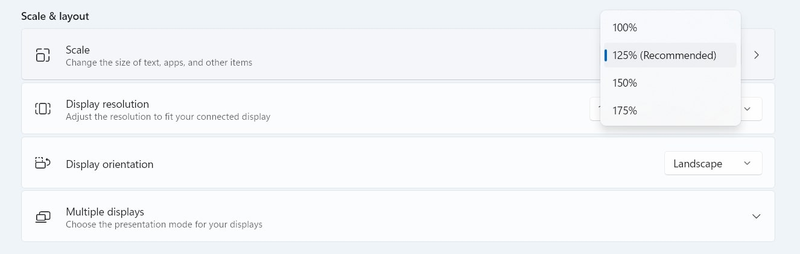

# 4K Adaptation

Responsive design usually focuses on mobile or fluid resizing. But on a 4K display (3840x2160), the problem is different: text, icons, and controls can become too small to read or click comfortably.

We explored a few approaches:

1. **Browser zoom**
   Flexible, but it is not reasonable to expect every user to adjust zoom each time.
2. **Windows display scaling**
   Because the system ran on Windows, we could set the OS-level Scale setting in Display Settings to enlarge the UI. This works after a one-time setup on the 4K machine, but it still requires manual configuration and the client declined it.



The client asked for a code-based solution. We first considered converting the UI to `rem`, but that would have required changing a large number of `px` values in the codebase (and likely in Figma). Given the time constraints and my limited experience with `rem` at the time, I tried a zooming approach instead.

I started with **CSS `zoom`**, which worked surprisingly well and took about 1-2 hours to implement. Later, a colleague refined the idea and replaced `zoom` with **CSS `transform: scale()`**, which is more standards-compliant and better supported across browsers.

This approach worked well in production, but it came with trade-offs:

- **Layout and component breakage**
  Some components compute widths and heights internally and were affected by scaling. We fixed issues like table height calculations and the positioning of date range pickers.
- **Animation quirks**
  Animations can behave unexpectedly under scaling. I did not see major problems, but we disabled a few default Ant Design animations where they were not needed.

If you are short on time, `zoom` or `scale` can be a pragmatic way to adapt an application for 4K screens. If you have more time, a `rem`-based approach is likely more robust long-term. I would be interested to hear about results from anyone who takes that path.

## Demo

Create a custom 4K device profile in Chrome DevTools (if you do not already have one):

1. Open DevTools and toggle the device toolbar.
2. In the device dropdown, select Edit, then Add custom device.
3. Create a new device with:
   - Width: 3840
   - Height: 2160
   - Device pixel ratio (DPR): 1 (or keep the default if you prefer)
4. Select the new device and refresh if needed.

Then try the snippet below:

```jsx
import React from 'react';
import { setupDynamicZoom } from 'ft2025/infrastructure/dynamicZoom';

export default () => {
  // setupDynamicZoom();

  return (
    <>
      Choose "Show code", then uncomment the line above to observe the zoom
      behavior.
    </>
  );
};
```
