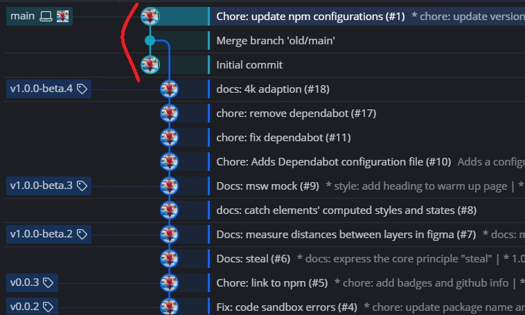

# Commits from _nowhere_

Have you ever seen a Git history like the one in the image above—where a commit appears to come from _nowhere_ and is then attached to an otherwise complete and linear history?

I came across this situation accidentally while migrating from an old repository to a new one. That "commit from nowhere" belongs to the new repository, while the long commit history below it originates from the old repository.

What happens here is that we start from the new repository, fetch the entire history from the old repository, and then merge the corresponding branch (for example, `old/main` → `main`). This operation stitches together two previously unrelated histories, resulting in a Git graph like the one shown.

Today, this entire migration process—from fetching the old history to merging it cleanly into the new repository—can be carried out almost entirely with the help of AI.
