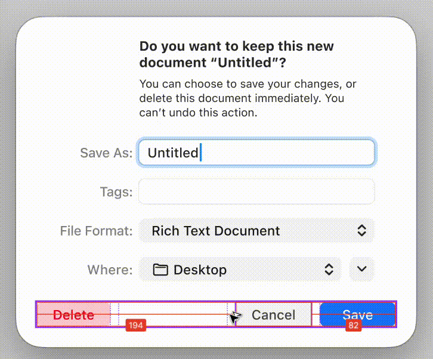

# Measure distances between layers in Figma

I discovered this feature quite by accident while working on Windows and frequently switching between a Figma window and another screen using Alt + Tab. At one point, red guide lines suddenly appeared on the screen. After encountering this behavior three or four times, I finally prompted myself to ask ChatGPT what the feature was. The keyword I eventually identified was "measure distances between layers".

You can refer to the official tutorial [here](https://help.figma.com/hc/en-us/articles/360039956974-Measure-distances-between-layers).
